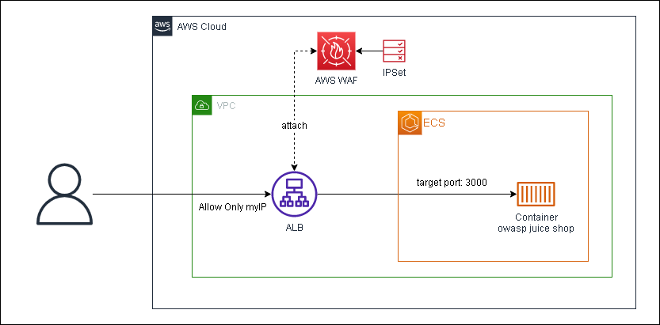

# OWASP Juice Shop on AWS CDK(Python)

This repository contains instructions and code to deploy OWASP Juice Shop on AWS using AWS Cloud Development Kit (CDK).

# architecture
[](https://app.diagrams.net/#Hraihalea%2Fcdk-owasp-juice%2Fmaster%2Farchitecture.drawio.png)

# description
By default, AWS WAF only allows access from "198.51.100.0/24" (i.e. other IP addresses are blocked).

You can modify the python code or change the IPSet from the AWS Management Console after deployment.

# deploy
If you have never used cdk, please see below.

https://docs.aws.amazon.com/cdk/v2/guide/getting_started.html


```
cdk deploy
```